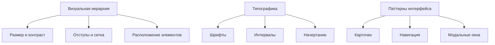
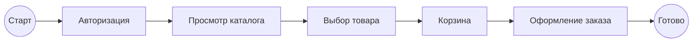
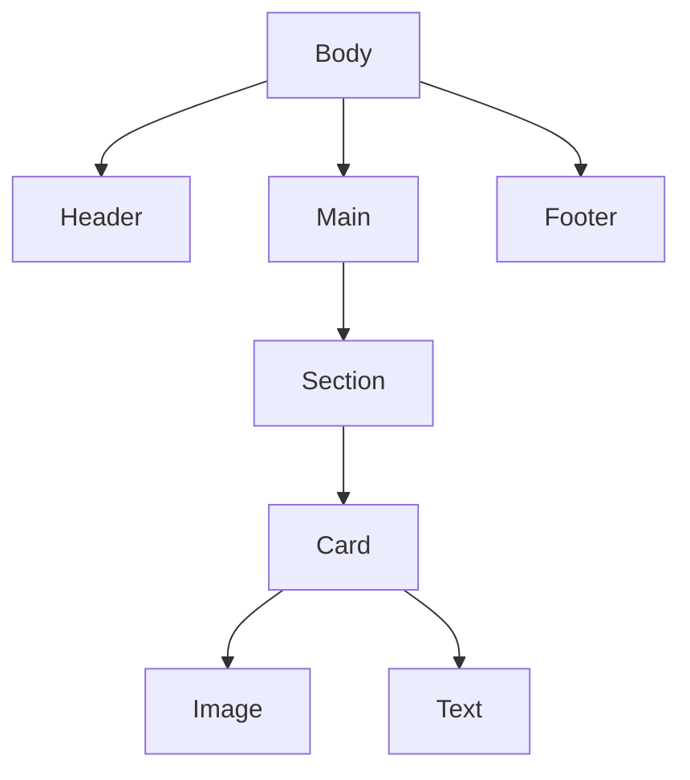

# **Теория. UI/UX(Принципы и оптимизация)**

## **2. Теория**

### **2.0. Цель работы**

Целью изучения данного теоретического раздела является формирование у обучающихся системного представления о принципах проектирования пользовательских интерфейсов (UI) и пользовательского опыта (UX), освоение базовых инструментов UI/UX-дизайна, а также понимание методов оптимизации интерфейсов с точки зрения удобства использования и производительности.

---

### **2.1. Принципы пользовательского интерфейса: иерархия, типографика, визуальные паттерны**

Основная задача UI-дизайна — обеспечить визуальную структуру интерфейса, удобство восприятия информации и согласованность элементов управления.

#### **2.1.1. Визуальная иерархия**

Визуальная иерархия определяет, какие элементы интерфейса пользователь воспринимает в первую очередь и каким образом распределяет внимание при взаимодействии с системой.

Для управления визуальной иерархией используются:

* размер элементов;
* цвет и контраст;
* отступы и группировка;
* расположение элементов на экране.

#### **2.1.2. Типографика**

Типографика определяет читаемость и удобство восприятия текстовой информации в интерфейсе. При проектировании типографики важно учитывать:

* выбор шрифтов;
* кегль (размер шрифта);
* межстрочные интервалы;
* начертание (обычный, полужирный, курсив);
* длину строки;
* выравнивание текста.

Грамотно подобранная типографика снижает когнитивную нагрузку пользователя и делает интерфейс визуально аккуратным и профессиональным.

#### **2.1.3. Визуальные паттерны**

Визуальные паттерны — это знакомые пользователю решения, которые повторяются в различных интерфейсах и упрощают восприятие системы:

* карточки (cards);
* списки (lists);
* панели навигации (navbars);
* модальные окна;
* «хлебные крошки» (breadcrumbs);
* вкладки (tabs) и аккордеоны.

Использование визуальных паттернов сокращает время обучения работе с интерфейсом и повышает общее удобство использования.

**Пример визуальной структуры UI (Mermaid):**



---

### **2.2. Основы UX-проектирования: юзабилити, пользовательские сценарии, адаптивный дизайн**

UX-проектирование определяет, каким образом пользователь взаимодействует с системой, насколько понятен путь достижения цели и насколько комфортен процесс использования программного продукта.

#### **2.2.1. Юзабилити**

Система с хорошим уровнем юзабилити:

* понятна и предсказуема;
* минимизирует количество пользовательских ошибок;
* снижает когнитивную нагрузку;
* позволяет достигать цели без лишних действий;
* предоставляет понятную и своевременную обратную связь.

#### **2.2.2. Пользовательские сценарии (User Flows)**

Пользовательский сценарий (User Flow) описывает последовательность действий пользователя при достижении определённой цели, например — оформление заказа в интернет-магазине.

Типовые этапы пользовательского сценария:

1. начальная точка (главная страница или авторизация);
2. выбор действия (поиск товара, переход в каталог);
3. прохождение шагов (просмотр карточки товара, корзина, ввод данных);
4. завершение задачи (оплата, подтверждение результата).

**Пример пользовательского сценария (Mermaid):**



#### **2.2.3. Адаптивный дизайн**

Адаптивный дизайн обеспечивает корректное отображение интерфейса на различных устройствах:

* мобильных телефонах;
* планшетах;
* ноутбуках;
* широкоформатных мониторах.

Основные техники адаптивности:

* гибкие сетки (Flexbox, Grid);
* относительные единицы измерения (`%`, `rem`, `vw`);
* медиа-запросы;
* responsive images (адаптация изображений под размер экрана).

---

### **2.3. Работа с векторными редакторами**

Векторные редакторы применяются для:

* создания UI-макетов;
* проектирования дизайн-систем;
* разработки интерактивных прототипов;
* совместной работы над проектом;
* построения схем и диаграмм;
* экспорта графических ресурсов.

Наиболее распространённые инструменты:

* Figma;
* Sketch;
* Adobe XD;
* Draw.io;
* Lunacy.

Figma поддерживает:

* работу с компонентами;
* auto-layout;
* дизайн-библиотеки;
* прототипирование пользовательских сценариев;
* дизайн-токены;
* совместную работу в реальном времени.

---

### **2.4. Понимание DOM-структуры и её влияние на производительность**

DOM (Document Object Model) представляет собой иерархическое дерево элементов веб-страницы. Чем сложнее и глубже структура DOM, тем выше нагрузка на:

* рендеринг страницы;
* перерасчёт стилей;
* перерисовку элементов (repaint и reflow).

#### **2.4.1. Проблемы перегруженного DOM**

* чрезмерная вложенность элементов;
* большое количество лишних контейнеров `<div>`;
* использование сложных CSS-селекторов;
* частые динамические изменения структуры страницы.

#### **2.4.2. Рекомендации по оптимизации**

* минимизация вложенности элементов;
* использование Flexbox и Grid вместо лишних обёрток;
* упрощение CSS-селекторов;
* сокращение количества тяжёлых графических элементов;
* применение `transform` вместо `top` и `left` для анимаций.

**Пример упрощённой DOM-структуры (Mermaid):**



---

### **2.5. Принципы микровзаимодействий**

Микровзаимодействия — это небольшие отклики интерфейса, которые информируют пользователя о реакции системы на его действия.

К микровзаимодействиям относятся:

* hover-эффекты;
* анимации при клике;
* плавные переходы состояний;
* индикаторы загрузки;
* уведомления о выполнении действий.

К микровзаимодействиям предъявляются следующие требования:

* быстрота (150–250 мс);
* лёгкость и ненавязчивость;
* отсутствие негативного влияния на производительность;
* понятность для пользователя.

---

### **2.6. Основы оптимизации графики**

#### **2.6.1. Форматы изображений**

Рекомендуемые форматы для веб-интерфейсов:

* **WebP** — оптимальное соотношение качества и размера;
* **SVG** — векторная графика;
* **AVIF** — современный формат с высоким уровнем сжатия;
* **PNG** — при необходимости прозрачности;
* **JPEG** — для фотографий.

#### **2.6.2. Техники оптимизации**

* сжатие изображений;
* подбор оптимального разрешения;
* использование ленивой загрузки (`loading="lazy"`);
* применение SVG-спрайтов;
* использование CDN.

#### **2.6.3. Responsive Images**

Механизм `srcset` и `sizes` позволяет загружать изображения оптимального размера в зависимости от устройства пользователя.

**Пример HTML-разметки:**

```html

```

 