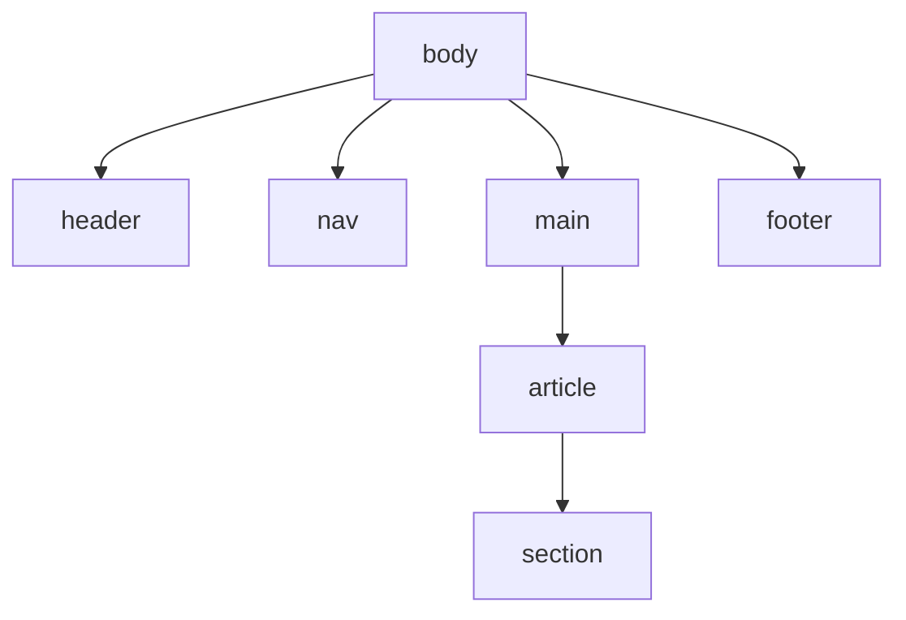
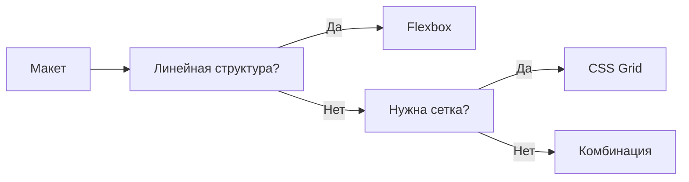
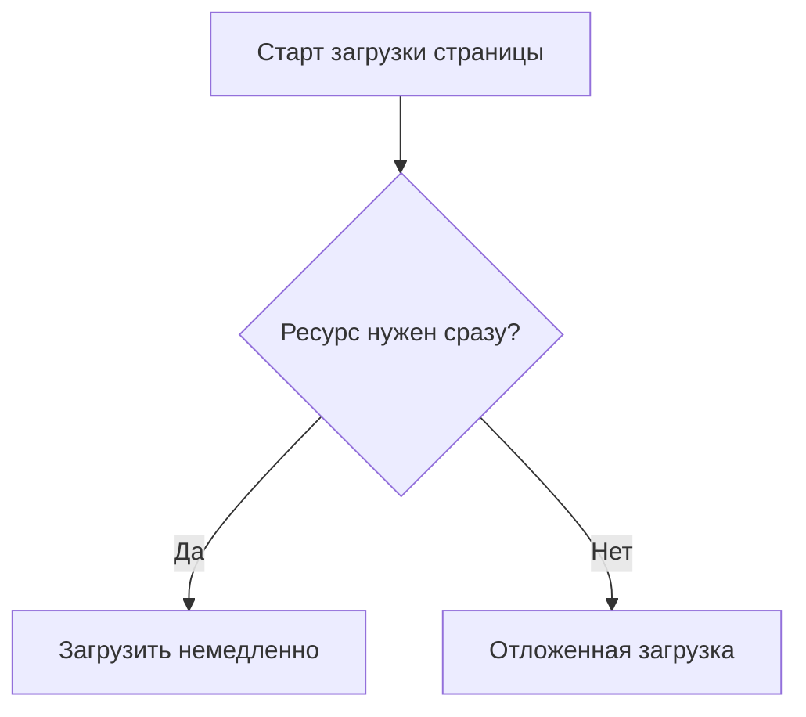
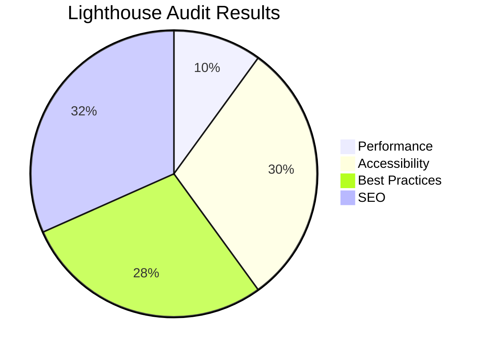

# **Теория. Frontend-разработка**

## **3. Теория**

### **3.0. Цель работы**

Целью изучения данного теоретического раздела является формирование у обучающихся системных знаний в области frontend-разработки, освоение принципов построения HTML-структуры, каскадных таблиц стилей и клиентского программирования, а также понимание методов оптимизации DOM, ресурсов и производительности пользовательского интерфейса.

---

### **3.1. HTML5: структура документа, семантика, оптимизация DOM**

HTML5 определяет структуру веб-страницы и напрямую влияет на восприятие содержимого браузером, поисковыми системами и пользователем. От качества HTML-разметки зависят доступность интерфейса, SEO-показатели и производительность приложения.

#### **3.1.1. Семантическая структура документа**

Семантическая разметка позволяет браузеру и вспомогательным технологиям корректно интерпретировать назначение элементов страницы.

**Пример базового HTML5-шаблона:**

```html
<!DOCTYPE html>
<html lang="ru">
<head>
    <meta charset="UTF-8" />
    <meta name="viewport" content="width=device-width, initial-scale=1.0" />
    <title>Пример HTML5</title>
</head>
<body>
    <header>Заголовок сайта</header>
    <nav>Меню</nav>
    <main>
        <article>
            <h1>Статья</h1>
            <section>Раздел статьи</section>
        </article>
    </main>
    <footer>Подвал</footer>
</body>
</html>
```

#### **3.1.2. Примеры семантических тегов**

* `<header>` — верхняя часть страницы или логического блока;
* `<nav>` — меню и навигационные элементы;
* `<main>` — основной контент страницы;
* `<article>` — самостоятельный логический блок (статья, новость);
* `<section>` — логический раздел документа;
* `<footer>` — нижняя часть страницы или раздела.

#### **3.1.3. Оптимизация DOM**

При проектировании HTML-структуры рекомендуется:

* избегать избыточного использования `<div>` и применять семантические теги;
* минимизировать глубину вложенности (желательно не более 4–5 уровней);
* объединять однотипные элементы;
* использовать списки для повторяющихся структур (например, меню);
* применять компонентный подход при повторении шаблонов.

**Пример оптимизированной DOM-структуры (Mermaid):**



---

### **3.2. CSS3: каскадность, селекторы, оптимизация весов и модульность стилей**

CSS управляет визуальным оформлением интерфейса. Грамотная организация стилей снижает вес файлов, уменьшает количество конфликтов и упрощает сопровождение проекта.

#### **3.2.1. Специфичность CSS-селекторов**

```css
/* Низкая специфичность */
button {
    color: black;
}

/* Средняя специфичность */
nav .menu button {
    color: blue;
}

/* Высокая специфичность */
#sidebar nav .menu button.active {
    color: red;
}
```

#### **3.2.2. Рекомендации по оптимизации CSS**

* использовать методологии (BEM, ITCSS и др.);
* избегать вложенности более чем на 3 уровня;
* минимизировать селекторы вида `div div div`;
* выносить повторяющиеся значения в CSS-переменные.

**Пример CSS-переменных:**

```css
:root {
    --accent-color: #ff5722;
}

button {
    background: var(--accent-color);
}
```

#### **3.2.3. Пример методологии BEM**

```html
<div class="card card--wide">
    <h2 class="card__title">Заголовок</h2>
    <p class="card__text">Описание</p>
</div>
```

---

### **3.3. Flexbox и CSS Grid для адаптивной вёрстки**

#### **3.3.1. Пример Flexbox**

```css
.menu {
    display: flex;
    justify-content: space-between;
    align-items: center;
}
```

Flexbox целесообразно использовать для:

* горизонтальных меню;
* карточек;
* панелей и тулбаров;
* выравнивания элементов по одной оси.

#### **3.3.2. Пример CSS Grid**

```css
.grid {
    display: grid;
    grid-template-columns: repeat(3, 1fr);
    gap: 20px;
}
```

CSS Grid применяется для:

* двухмерных макетов;
* каталогов и карточных сеток;
* сложных адаптивных структур.

**Логика выбора Flexbox и Grid (Mermaid):**



---

### **3.4. JavaScript (ES6+): оптимизация кода, работа с DOM и событиями**

JavaScript обеспечивает интерактивность, динамическую загрузку данных и реактивность интерфейса.

#### **3.4.1. Современные возможности ES6+**

```js
const apiUrl = "/api/products";

async function loadProducts() {
    const response = await fetch(apiUrl);
    const data = await response.json();
    console.log(data);
}

loadProducts();
```

#### **3.4.2. Работа с DOM и событиями**

```js
const button = document.querySelector(".btn");

button.addEventListener("click", () => {
    console.log("Кнопка нажата");
});
```

#### **3.4.3. Оптимизация событий (debounce)**

```js
function debounce(fn, delay) {
    let timeout;
    return (...args) => {
        clearTimeout(timeout);
        timeout = setTimeout(() => fn(...args), delay);
    };
}

window.addEventListener("resize", debounce(() => {
    console.log("Оптимизированное событие resize");
}, 200));
```

#### **3.4.4. Снижение нагрузки на интерфейс**

* минимизация обращений к DOM;
* кэширование DOM-элементов и данных;
* использование делегирования событий;
* асинхронная загрузка тяжёлых ресурсов.

---

### **3.5. Lazy-loading и динамическая подгрузка ресурсов**

#### **3.5.1. Ленивaя загрузка изображений**

```html

```

#### **3.5.2. Динамический импорт JavaScript-модулей**

```js
document.querySelector("#open").addEventListener("click", async () => {
    const module = await import("./modal.js");
    module.openModal();
});
```

Данные подходы позволяют сократить время первоначальной загрузки и улучшить показатели FCP и LCP.

**Логика подгрузки ресурсов (Mermaid):**



---

### **3.6. Аудит производительности в Chrome DevTools**

Chrome DevTools является основным инструментом анализа качества frontend-части приложения.

#### **3.6.1. Вкладка Network**

Позволяет анализировать:

* количество запросов;
* размер ресурсов;
* порядок и время загрузки;
* блокирующие CSS и JS-файлы.

#### **3.6.2. Вкладка Performance**

Используется для оценки:

* работы основного JS-потока;
* рендеринга и layout-циклов;
* обработки событий;
* перерисовок интерфейса.

#### **3.6.3. Lighthouse**

Lighthouse выполняет автоматический аудит по направлениям:

* Performance;
* Accessibility;
* Best Practices;
* SEO;
* Progressive Web App.

