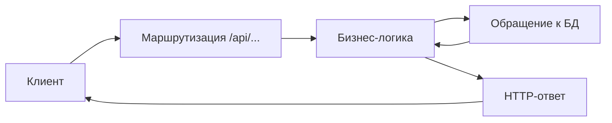
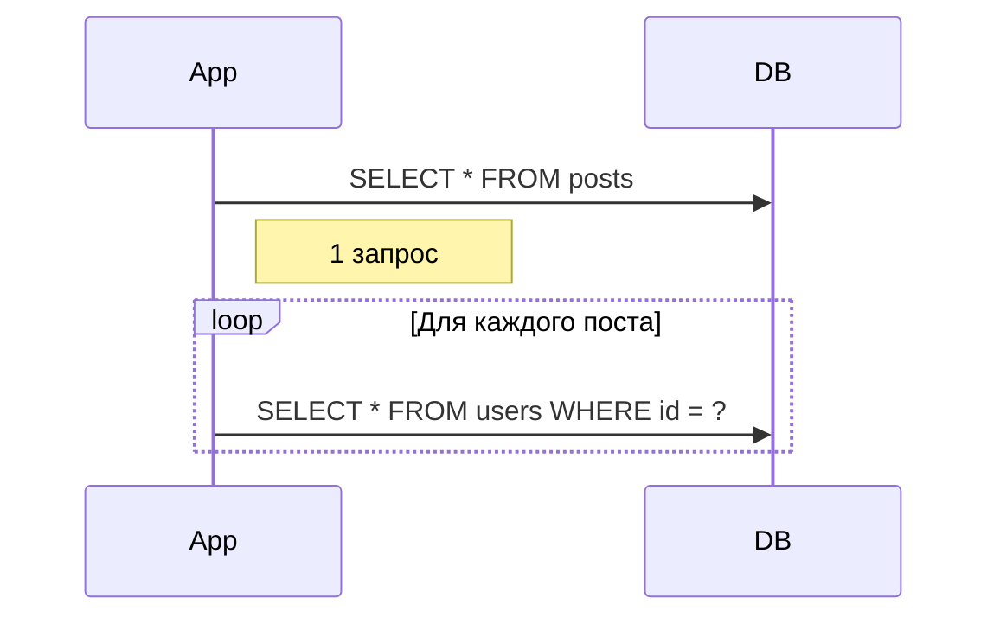
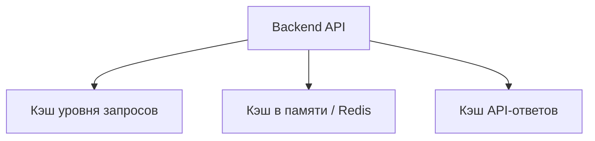
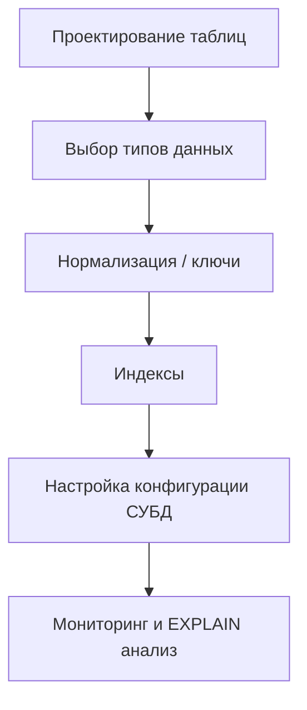

# **Теория. Backend-разработка**

## **4. Теория**

### **4.0. Цель работы**

Целью изучения данного теоретического раздела является формирование у обучающихся системных знаний в области backend-разработки: понимание принципов серверной архитектуры, обработки HTTP-запросов, проектирования и оптимизации SQL-запросов, устранения проблем производительности (включая N+1), применения кэширования и настройки СУБД для обеспечения стабильной и эффективной работы серверной части информационной системы.

---

### **4.1. Принципы серверной архитектуры и обработка HTTP-запросов**

Backend — серверная часть приложения, которая принимает HTTP-запросы, выполняет бизнес-логику, обращается к базе данных и формирует ответ.

#### **4.1.1. Пример REST-маршрута (Node.js / Express)**

```js
const express = require("express");
const app = express();

app.use(express.json());

app.get("/api/users/:id", (req, res) => {
    const userId = req.params.id;
    res.json({ message: "Получен пользователь", id: userId });
});

app.post("/api/users", (req, res) => {
    const data = req.body;
    res.status(201).json({ created: true, data });
});

app.listen(3000, () => console.log("Server running on port 3000"));
```

#### **4.1.2. Типы HTTP-методов**

* **GET** — получение данных
* **POST** — создание ресурса
* **PUT** — полное обновление ресурса
* **PATCH** — частичное обновление
* **DELETE** — удаление

#### **4.1.3. Пример HTTP-ответа**

```json
{
  "status": "ok",
  "data": { "id": 5, "name": "Alex" }
}
```

#### **4.1.4. Логика обработки HTTP-запроса (Mermaid)**



---

### **4.2. SQL: SELECT, JOIN, агрегирование, индексы**

#### **4.2.1. SELECT — выборка данных**

```sql
SELECT id, name, email 
FROM users 
WHERE active = true;
```

#### **4.2.2. JOIN — объединение таблиц**

```sql
SELECT users.name, orders.total_price
FROM users
JOIN orders ON users.id = orders.user_id;
```

#### **4.2.3. Агрегирующие функции**

```sql
SELECT 
    COUNT(*) AS total_orders,
    SUM(total_price) AS revenue,
    AVG(total_price) AS average_check
FROM orders;
```

#### **4.2.4. Индексы**

```sql
CREATE INDEX idx_orders_user_id
ON orders(user_id);
```

Индексы ускоряют выборку, соединения и сортировку, но замедляют операции `INSERT/UPDATE`.

---

### **4.3. Анализ SQL-запросов с помощью EXPLAIN**

EXPLAIN показывает используемые индексы, количество строк, тип соединений и узкие места.

#### **4.3.1. Пример EXPLAIN**

```sql
EXPLAIN
SELECT users.name, orders.total_price
FROM users
JOIN orders ON users.id = orders.user_id
WHERE users.active = true;
```

**Упрощённый результат:**

```text
Nested Loop
 ├─ Filter: (active = true)
 │   └─ Seq Scan on users
 └─ Index Scan using idx_orders_user_id on orders
```

**Проблема:** `Seq Scan` — полное сканирование таблицы.

#### **4.3.2. Оптимизация**

```sql
CREATE INDEX idx_users_active ON users(active);
```

---

### **4.4. Приёмы борьбы с проблемой N+1**

N+1 — 1 запрос + N дополнительных запросов для связанных данных.

#### **4.4.1. Пример N+1 в ORM**

```js
const posts = await Post.findAll();

for (const post of posts) {
    const author = await post.getAuthor(); // ещё один запрос
}
```

100 постов → 101 запрос.

#### **4.4.2. Решение: eager loading**

```js
const posts = await Post.findAll({
    include: ["author"]
});
```

ORM выполнит один JOIN вместо 100 запросов.

#### **4.4.3. Схема N+1 (Mermaid)**



---

### **4.5. Принципы кэширования**

Кэширование ускоряет backend и снижает нагрузку на БД.

#### **4.5.1. Кэширование в памяти (Redis)**

```js
const redis = require("redis");
const client = redis.createClient();

app.get("/api/products", async (req, res) => {
    const cache = await client.get("products");

    if (cache) return res.json(JSON.parse(cache));

    const data = await db.getProducts();
    await client.set("products", JSON.stringify(data), { EX: 180 });

    res.json(data);
});
```

#### **4.5.2. Кэширование SQL-запросов**

```js
await db.cacheQuery("SELECT * FROM categories");
```

#### **4.5.3. Кэширование API-ответов**

```js
res.set("Cache-Control", "public, max-age=3600");
res.json(data);
```

#### **4.5.4. Уровни кэширования (Mermaid)**



---

### **4.6. Оптимизация структуры таблиц и конфигурации СУБД**

#### **4.6.1. Правильные типы данных**

* INTEGER vs BIGINT
* VARCHAR(50) вместо TEXT
* BOOLEAN вместо INTEGER

#### **4.6.2. Первичные и внешние ключи**

```sql
CREATE TABLE orders (
    id SERIAL PRIMARY KEY,
    user_id INT REFERENCES users(id),
    total_price NUMERIC(10, 2)
);
```

#### **4.6.3. Частичные индексы**

```sql
CREATE INDEX idx_users_active
ON users(active)
WHERE active = true;
```

#### **4.6.4. Настройки СУБД**

* pool size
* shared_buffers
* work_mem
* логирование медленных запросов
* autovacuum

#### **4.6.5. Общая логика оптимизации СУБД (Mermaid)**


