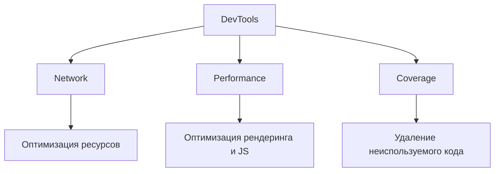
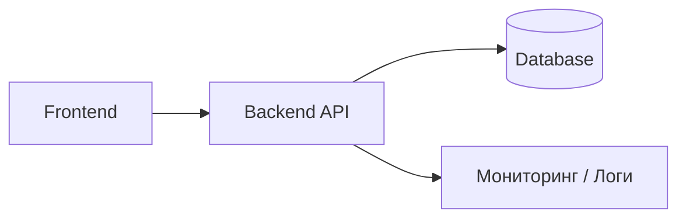
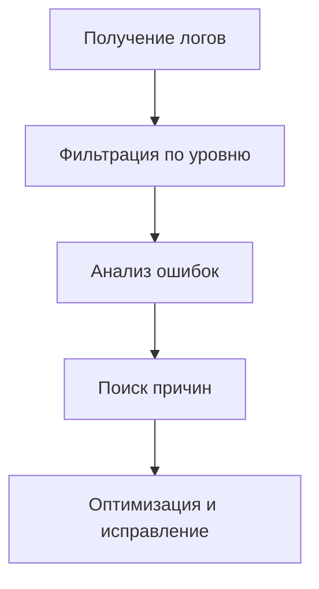
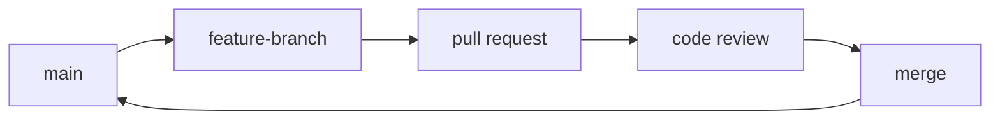

# **Теория. Инструменты frontend/backend-разработчика**

## **5. Теория**

### **5.0. Цель работы**

Целью изучения данного теоретического раздела является формирование у обучающихся практических и аналитических навыков работы с основными инструментами frontend- и backend-разработчика, включая средства анализа производительности, проектирования интерфейсов, чтения логов и метрик, а также управления исходным кодом и командной разработки с использованием Git и GitHub.

---

### **5.1. Использование Chrome DevTools**

Chrome DevTools — основной инструмент анализа фронтенд-приложений. Он позволяет исследовать загрузку ресурсов, работу JavaScript-кода, процессы рендеринга и общую производительность интерфейса.

#### **5.1.1. Раздел Network — анализ сетевых запросов**

**Раздел Network позволяет:**

* видеть общее количество HTTP-запросов;
* анализировать статус-коды ответов;
* оценивать вес загружаемых файлов;
* выявлять блокирующие ресурсы;
* отслеживать работу API.

**Пример анализа сетевых запросов:**

```text
GET /api/users      200 OK   45 ms   2.1 KB
GET /styles.css     200 OK   12 ms   14 KB
GET /image.png      200 OK   98 ms   620 KB   ⚠ слишком тяжёлое изображение
```

#### **5.1.2. Раздел Performance — работа JavaScript и рендеринг**

**Раздел Performance показывает:**

* long tasks (длительные операции JavaScript);
* этапы Recalculate Style, Layout, Paint;
* обработку событий;
* частоту кадров (FPS).

**Примеры выявляемых проблем:**

```text
"Recalculate Style: 87ms" — слишком сложные селекторы  
"Layout: 120ms"          — тяжёлая сетка Grid  
"Long task: 300ms"       — неоптимальный цикл JavaScript
```

#### **5.1.3. Раздел Coverage — анализ неиспользуемого кода**

Coverage позволяет определить, какая часть CSS- и JS-кода реально используется приложением.

```text
styles.css    10% used  
main.js       32% used  
framework.js  5% used  ⚠ подключён весь фреймворк, используется минимальный функционал
```

**Связь разделов DevTools (Mermaid):**



---

### **5.2. Использование Figma и Draw.io**

Figma применяется для проектирования пользовательских интерфейсов и UX-прототипов, Draw.io — для построения диаграмм, архитектурных схем и технической документации.

#### **5.2.1. Figma — дизайн и прототипирование**

**Figma используется для:**

* создания UI-макетов;
* разработки дизайн-систем;
* создания интерактивных прототипов;
* реализации адаптивного дизайна (Auto Layout);
* совместной работы команды в реальном времени.

**Пример структуры проекта в Figma:**

```text
/UI Kit
    - Colors
    - Typography
    - Components

/Pages
    - Login
    - Dashboard
    - Profile

/Prototypes
```

#### **5.2.2. Draw.io — схемы и модели**

**Draw.io используется для:**

* блок-схем (flowcharts);
* UML-диаграмм;
* ER-моделей данных;
* архитектурных схем;
* оформления технической документации.

**Пример логической схемы:**

```text
Client → API Gateway → Auth Service
                      → User Service
                      → Order Service

Database → PostgreSQL
```

**Пример архитектурной схемы (Mermaid):**



---

### **5.3. Навыки чтения логов и интерпретации метрик**

#### **5.3.1. Уровни логирования**

| Уровень   | Назначение         |
| --------- | ------------------ |
| **DEBUG** | технические детали |
| **INFO**  | события приложения |
| **WARN**  | возможные проблемы |
| **ERROR** | ошибки выполнения  |
| **FATAL** | критические сбои   |

#### **5.3.2. Пример логов в формате JSON**

```json
{
  "level": "ERROR",
  "timestamp": "2025-02-01T12:41:22Z",
  "service": "OrderService",
  "message": "Database timeout",
  "details": {
    "query": "SELECT * FROM orders",
    "duration_ms": 1500
  }
}
```

#### **5.3.3. Основные метрики мониторинга**

* **Response Time** — скорость ответа сервиса;
* **Throughput (RPS)** — количество запросов в секунду;
* **CPU / Memory Usage** — загрузка ресурсов;
* **Error Rate** — доля ошибок;
* **DB Connections** — нагрузка на базу данных;
* **Cache Hit Ratio** — эффективность кэширования.

**Процесс анализа логов и метрик (Mermaid):**



---

### **5.4. Работа с Git и GitHub**

#### **5.4.1. Основные команды Git**

```bash
git init
git clone <repo>
git checkout -b feature/login
git add .
git commit -m "Implement login"
git push origin feature/login
```

#### **5.4.2. Pull Request — пример описания**

```markdown
# Feature: Добавление формы авторизации

## Что сделано
- Создан компонент LoginForm
- Добавлены валидации
- Настроена отправка данных на API

## Как тестировать
1. Открыть /login
2. Ввести email и пароль
3. Проверить API-запрос
```

#### **5.4.3. GitHub Issues — документирование задач**

```text
[BUG] Некорректный заголовок на мобильной версии

Описание: навигационная панель перекрывает контент.
Приоритет: высокий

Шаги для воспроизведения:
1. Открыть страницу на смартфоне
2. Прокрутить вниз

Ожидаемое поведение: контент отображается корректно
```

#### **5.4.4. Git для отчётности и сопровождения проекта**

* `README.md` — основная документация проекта;
* `Wiki` — расширенная документация;
* `Issues` — список задач и проблем;
* `Pull Requests` — история изменений и ревью;
* `Releases` — итоговые версии продукта.

**Типовой Git-workflow (Mermaid):**


 