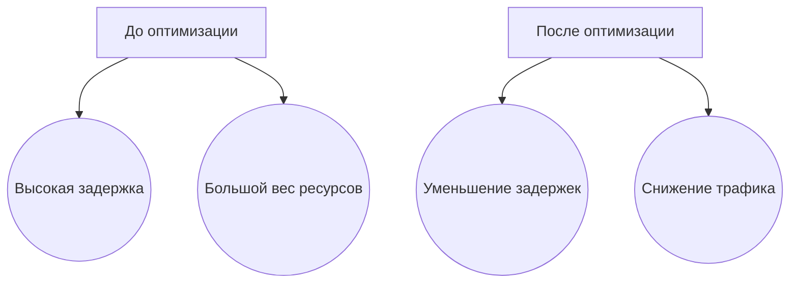
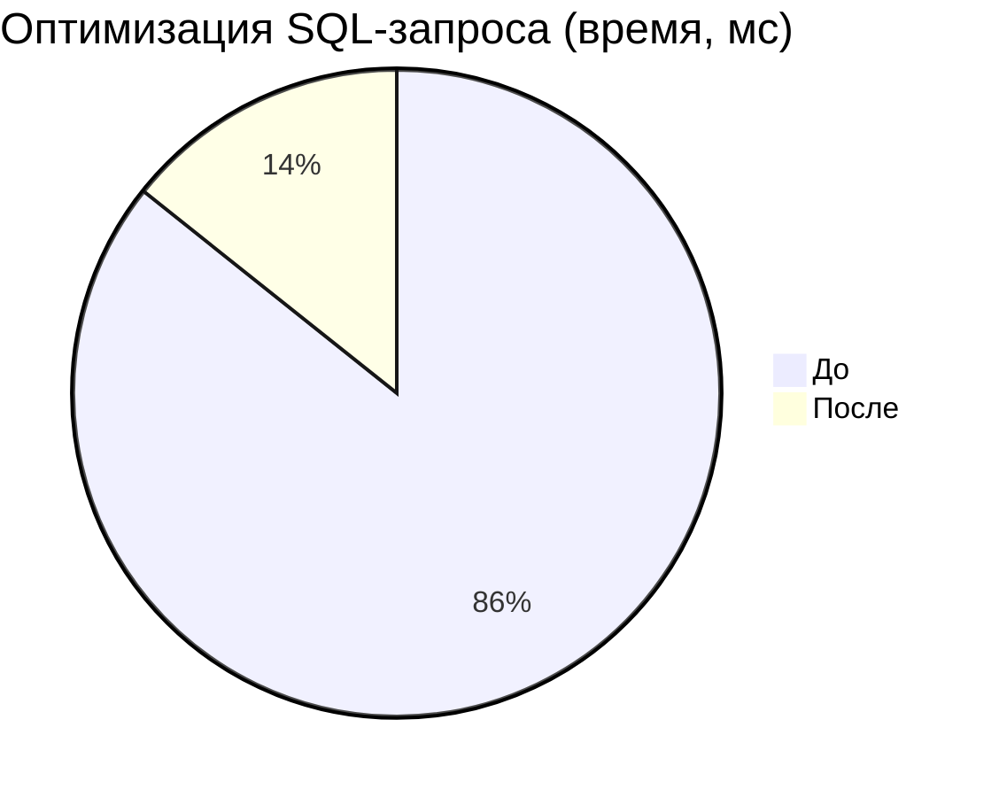
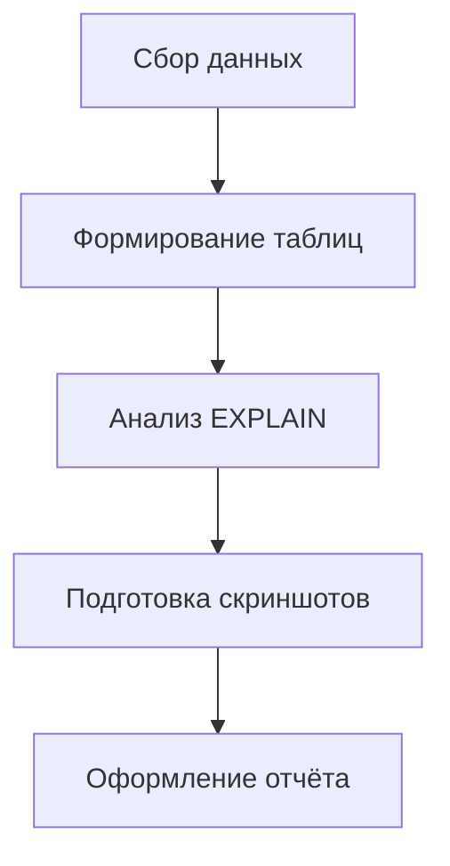

# **Теория. Отчётность и аналитика**

## **6. Теория**

### **6.0. Цель работы**

Целью изучения данного теоретического раздела является формирование у обучающихся навыков подготовки аналитических материалов и технической отчётности по результатам оптимизации веб-приложений, а также освоение методов сравнения показателей эффективности, оформления результатов измерений и корректного использования профессиональной терминологии.

---

### **6.1. Способы сравнения показателей эффективности**

Оценка эффективности веб-приложения основывается на анализе метрик, отражающих техническое состояние и производительность системы **до и после оптимизации**. Измерения выполняются с использованием Chrome Lighthouse, Chrome DevTools, серверного мониторинга и анализа SQL-запросов.

#### **6.1.1. Типовые метрики web-производительности**

| Метрика                        | Назначение                                 |
| ------------------------------ | ------------------------------------------ |
| FCP (First Contentful Paint)   | время появления первого контента           |
| LCP (Largest Contentful Paint) | время отображения основного блока страницы |
| TTI (Time to Interactive)      | время до полной интерактивности            |
| Requests count                 | количество сетевых запросов                |
| Total network weight           | общий вес загруженных ресурсов             |
| JS execution time              | время выполнения JavaScript-кода           |
| CPU load                       | нагрузка на процессор                      |
| Memory usage                   | использование оперативной памяти           |
| Server Response Time           | задержки API / backend                     |
| SQL latency                    | время выполнения SQL-запросов              |

#### **6.1.2. Пример измерений до и после оптимизации**

```text
FCP:        2.8 s  → 1.4 s
LCP:        4.2 s  → 1.9 s
JS Exec:    950 ms → 380 ms
Network:    3.4 MB → 1.1 MB
SQL-query:  240 ms → 40 ms (после добавления индекса)
```

#### **6.1.3. Диаграмма сравнения результатов (Mermaid)**



---

### **6.2. Подготовка таблиц «до / после оптимизации»**

Сравнительные таблицы являются ключевым инструментом аналитики. Они позволяют наглядно и объективно зафиксировать улучшения производительности и обосновать эффективность выполненных работ.

#### **6.2.1. Пример таблицы улучшений**

| Метрика                | До     | После  | Улучшение |
| ---------------------- | ------ | ------ | --------- |
| FCP                    | 2.8 s  | 1.4 s  | −50%      |
| LCP                    | 4.2 s  | 1.9 s  | −54%      |
| Вес JS                 | 980 KB | 320 KB | −67%      |
| SQL-запрос `/products` | 240 ms | 40 ms  | −83%      |
| Количество запросов    | 37     | 21     | −43%      |

#### **6.2.2. Пример графика улучшений (Mermaid Pie)**



#### **6.2.3. Шаблон таблицы для отчёта**

```text
| Метрика | Значение до | Значение после | Разница | Комментарий |
|---------|-------------|----------------|---------|-------------|
|         |             |                |         |             |
|         |             |                |         |             |
```

---

### **6.3. Оформление технических отчётов, скриншоты и EXPLAIN-планы**

Технический отчёт должен быть **структурированным, доказательным и воспроизводимым** — по нему другой специалист должен иметь возможность повторить измерения и подтвердить полученные результаты.

#### **6.3.1. Структура технического отчёта**

1. **Введение**

   * цель оптимизации;
   * краткая характеристика системы.
2. **Методика измерений**

   * используемые инструменты (Lighthouse, Chrome DevTools, PostgreSQL EXPLAIN);
   * условия тестирования (окружение, нагрузка).
3. **Результаты измерений**

   * таблицы;
   * графики;
   * скриншоты DevTools и Lighthouse.
4. **Выполненные оптимизации**

   * сжатие и объединение ресурсов;
   * оптимизация SQL-запросов;
   * добавление индексов.
5. **EXPLAIN-анализ**

   * сравнение планов выполнения запросов.
6. **Выводы**

   * итоговая оценка эффективности и рекомендации.

#### **6.3.2. Пример EXPLAIN-плана (до оптимизации)**

```text
Seq Scan on products  (cost=0.00..1820.00 rows=90000 width=120)
  Filter: (category_id = 5)
```

**Проблема:** полное сканирование таблицы — отсутствует индекс.

#### **6.3.3. EXPLAIN-план после оптимизации**

```text
Index Scan using idx_products_category_id on products  
  (cost=0.43..32.21 rows=120 width=120)
```

Количество обрабатываемых строк сократилось примерно в 700 раз, что привело к существенному снижению времени выполнения запроса.

#### **6.3.4. Пример вставки скриншота в отчёт**

```markdown


На изображении видно, что вес страницы составляет 3.4 MB.
После оптимизации он уменьшился до 1.1 MB.
```

#### **6.3.5. Процесс подготовки отчёта (Mermaid)**



---

### **6.4. Корректное использование терминологии и академического стиля**

При подготовке официальной отчётности необходимо соблюдать академический стиль изложения и профессиональную терминологию.

#### **6.4.1. Принципы академического стиля**

* точные и однозначные формулировки
  *(«SQL-запрос был оптимизирован путём добавления индекса»)*;
* отказ от разговорных выражений
  *(недопустимо: «запрос тупил», «страница лагала»)*;
* логичная и последовательная структура;
* корректные ссылки на инструменты и версии;
* единая терминология во всём документе;
* количественная и объективная оценка результатов
  *(«время выполнения уменьшилось на 40%»)*.

#### **6.4.2. Пример фрагмента отчёта**

```text
В результате оптимизации SQL-запроса
SELECT * FROM products WHERE category_id = 5
время выполнения уменьшилось с 240 мс до 40 мс.

Сокращение достигнуто за счёт создания индекса:

CREATE INDEX idx_products_category_id ON products(category_id);

План выполнения изменился с Seq Scan на Index Scan,
что существенно сократило количество анализируемых строк.
```
 
