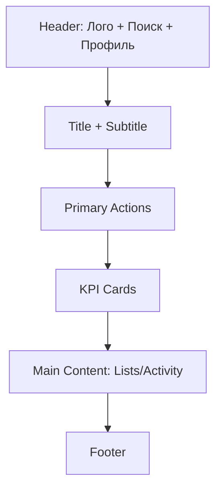
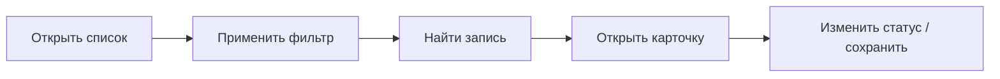

# **Выполнение задания. Дизайн интерфейсов**

## **Цель работы**

На основе ранее созданного прототипа информационной системы выполнить модернизацию интерфейса, улучшив:

* удобство использования (UX);
* адаптивность (Desktop / Tablet / Mobile);
* визуальную структуру (UI: сетка, типографика, компоненты);
* производительность (упрощение DOM, оптимизация графики).

Работа выполняется в одном из инструментов:

* Figma;
* Draw.io;
* Whimsical;
* Penpot;
* Adobe XD.

---

## **8.1. Подготовительный этап**

### **Шаг 1. Сбор материалов ранее созданного прототипа**

Обучающийся должен подготовить:

* скриншоты текущей версии интерфейса **(минимум 5 экранов)** или исходный файл (Figma / Draw.io и т.д.);
* результаты анализа UX (если выполнялся ранее) или краткие замечания по проблемам интерфейса;
* описание логики экранов и сценариев работы пользователя;
* структуру DOM (если есть фронтенд-реализация) или пример структуры блоков (если это только прототип).

**Цель шага:** выявить элементы интерфейса, требующие оптимизации, и сформировать список улучшений.

#### **Что сдаётся по шагу (пример оформления в документации)**

```markdown
## Результаты подготовки

### Исходные экраны
1) Главная (dashboard)
2) Список объектов (например: заявки / товары / туры)
3) Карточка объекта
4) Форма создания/редактирования
5) Поиск/фильтры

### Основные проблемы (UX/UI)
- слишком много кнопок на главном экране → перегруз;
- форма длинная и без группировки → ошибки ввода;
- фильтры находятся слишком далеко → неудобно;
- в карточке объекта нет визуальной иерархии (заголовок/статус/действия);
- на мобильной версии элементы слишком мелкие, кликабельность низкая.

### Цели оптимизации
- сократить «шум» на экране;
- унифицировать кнопки и поля ввода;
- сделать адаптивные версии;
- уменьшить количество визуальных контейнеров и вложенность блоков.
```

---

## **8.2. Построение нового прототипа с оптимизацией интерфейса**

### **Шаг 2. Создание или обновление ключевых экранов**

Необходимо переработать:

* главный экран;
* навигационную область (меню / хедер / сайдбар);
* ключевые страницы:

  * **список** (таблица/карточки + фильтры),
  * **карточка** (детальная информация),
  * **форма** (создание/редактирование),
  * **поиск** (фильтрация, сортировка).
* пользовательские сценарии (**User Flow → экран → действие → результат**).

---

### **Требования к интерфейсам**

Каждый экран должен включать:

* чёткую визуальную иерархию (заголовок → статус → действия → контент);
* структуру без избыточных элементов (минимум рамок/контейнеров);
* единый стиль (цвета, типографика, сетка, компоненты);
* согласованные элементы управления (кнопки, инпуты, отступы, выравнивания).

---

## **8.2.1. Пример 1 — Главный экран (Dashboard)**

### **Как должен выглядеть (пример структуры)**

```text
┌──────────────────────────────────────────────────────────────┐
│ Лого      Поиск…                    Уведомления   Профиль     │
├──────────────────────────────────────────────────────────────┤
│ Заголовок: Панель управления                                   │
│ Подзаголовок: краткое описание состояния системы                │
├──────────────────────────────────────────────────────────────┤
│ [Создать] [Импорт] [Справка]          Статус: Онлайн            │
├──────────────────────────────────────────────────────────────┤
│ KPI-блоки:                                                     │
│ [Новые: 12]  [В работе: 8]  [Просрочено: 2]  [Закрыто: 31]     │
├──────────────────────────────────────────────────────────────┤
│ Основной контент:                                              │
│ - Последние действия (лог)                                     │
│ - Быстрые ссылки (популярные разделы)                           │
├──────────────────────────────────────────────────────────────┤
│ Футер                                                          │
└──────────────────────────────────────────────────────────────┘
```

### **Пример экранной логики (что пользователь делает на Dashboard)**

* видит общий статус и ключевые показатели;
* быстро создаёт новый объект (например: заявку/тур/заказ);
* переходит к спискам и фильтрам;
* просматривает последние изменения.

### **Mermaid-схема компоновки**



---

## **8.2.2. Пример 2 — Экран “Список” (таблица/карточки + фильтры)**

### **Как должен выглядеть (пример)**

```text
Заголовок: Список заявок
Подзаголовок: управление, поиск, фильтрация

[Поиск…________________] [Статус ▼] [Период ▼] [Сбросить]
----------------------------------------------------------------
| №  | Тема               | Статус     | Дата      | Действия   |
| 12 | Не работает принтер | В работе   | 12.02.25  | Открыть    |
| 13 | Замена картриджа    | Новая      | 12.02.25  | Открыть    |
----------------------------------------------------------------
Пагинация: 1 2 3 …     [Экспорт] [Создать]
```

### **Правильная структура фильтров (пример правил)**

* фильтры всегда **над списком**;
* кнопка “Сбросить” — рядом с фильтрами;
* основные действия (“Создать”, “Экспорт”) — справа или в верхней панели.

### **Mermaid: User Flow для списка**



---

## **8.2.3. Пример 3 — Карточка объекта (детальный просмотр)**

### **Шаблон карточки (пример)**

```text
Заголовок: Заявка #12 — Не работает принтер
Статус: [В работе]     Приоритет: [Высокий]     Дедлайн: 15.02

[Редактировать] [Сменить статус ▼] [Назначить исполнителя] [Закрыть]

--------------------------------------------------------------
Раздел 1. Описание
- Текст обращения
- Вложения (иконки файлов)

Раздел 2. История
- 12.02: создано пользователем
- 13.02: назначен исполнитель
- 14.02: комментарий исполнителя

Раздел 3. Комментарии
[поле ввода комментария____________________] [Отправить]
--------------------------------------------------------------
```

### **Что важно в визуальной иерархии**

1. Заголовок и ключевые метки (статус/приоритет/дедлайн) — наверху.
2. Основные действия — одной группой.
3. Контент — блоками с заголовками (Описание / История / Комментарии).

---

## **8.2.4. Пример 4 — Форма создания/редактирования (длинная форма → удобная форма)**

### **Пример “плохо” (частая ошибка)**

* 15 полей подряд, без разделов;
* обязательные поля не выделены;
* нет подсказок, ошибки показываются поздно.

### **Пример “хорошо” (структура формы)**

```text
Заголовок: Создать заявку

Блок 1. Основные данные
- Тема* [__________________]
- Категория* [▼]
- Приоритет  [▼]

Блок 2. Описание
- Описание [______________________________]
- Вложения [Загрузить файл]

Блок 3. Назначение
- Исполнитель [▼]
- Дедлайн     [📅]

[Отмена]                           [Сохранить]
```

### **Правила формы (требования)**

* обязательные поля помечаются `*`;
* подсказки показываются сразу (helper text);
* ошибки — у конкретного поля;
* кнопки “Отмена / Сохранить” — всегда внизу и фиксированы в логике.

---

## **8.3. Адаптивные версии: Desktop / Tablet / Mobile**

### **Шаг 3. Подготовка адаптивных макетов**

Для каждого ключевого экрана необходимо подготовить **3 версии**:

* **Desktop** (≥ 1280 px);
* **Tablet** (768–1024 px);
* **Mobile** (≤ 480–600 px).

---

### **Подробный пример адаптации “Список”**

#### Desktop (12 колонок)

* фильтры в одну строку;
* таблица с 5–6 колонками;
* действия (“Создать”) справа.

#### Tablet (6–8 колонок)

* фильтры переносятся на 2 строки;
* таблица сокращается (часть колонок скрывается);
* действия остаются сверху.

#### Mobile (1–4 колонки)

* таблица превращается в карточки;
* фильтры — в “панель фильтров” или bottom-sheet;
* основные действия — фиксированная кнопка (FAB) или верхняя.

---

### **Правила адаптации (расширенные)**

| Компонент | Desktop      | Tablet                | Mobile                    |
| --------- | ------------ | --------------------- | ------------------------- |
| Навигация | хедер + меню | бургер + сокращение   | бургер / нижняя навигация |
| Списки    | таблица      | таблица (укороченная) | карточки                  |
| Фильтры   | всегда видны | частично скрыты       | отдельная панель          |
| Текст     | базовый      | слегка крупнее        | крупный, короткие строки  |
| Тап-зоны  | 40×40+       | 44×44                 | 44×44+                    |

---

## **8.4. Оптимизация элементов интерфейса (упрощение DOM)**

### **Шаг 4. Анализ на избыточность**

Нужно выявить:

* дублирующиеся кнопки;
* чрезмерную вложенность блоков;
* декоративные контейнеры без функции;
* длинные формы без группировки;
* повторяющиеся заголовки и рамки.

---

### **Подробный пример оптимизации (реальный кейс)**

#### До (перегруженная вложенность)

```text
div.page
  div.container
    div.wrapper
      div.content
        div.card
          div.card-inner
            div.card-header
              div.row
                div.col
                  h2
```

#### После (коротко и логично)

```text
main.page
  section.card
    header
      h2
    div.content
```

### **Что нужно описать в отчёте (пример)**

```markdown
### Оптимизация структуры
- Удалены декоративные контейнеры wrapper/content без функционала.
- Заголовок перенесён в header внутри card.
- Уменьшена вложенность: 8 уровней → 4 уровня.
Результат: проще верстка, быстрее рендеринг, легче поддержка.
```

---

## **8.5. Дизайнерские анимации и микроанимации**

### **Шаг 5. Проработка микровзаимодействий**

Нужно описать состояния компонентов:

* hover / active / focus;
* loading / disabled;
* success / error.

---

### **Подробный пример (кнопка “Сохранить”)**

```text
Компонент: Primary Button

Состояния:
- Default: обычный вид
- Hover: лёгкое увеличение (scale 1.02), тень чуть сильнее
- Active: уменьшение (scale 0.98)
- Focus: обводка 2px (для доступности)
- Loading: вместо текста индикатор + блокировка
- Disabled: прозрачность 50%, клики отключены

Параметры:
- Длительность: 120–180 ms
- Кривая: ease-in-out
```

### **Подробный пример (валидация формы)**

* при ошибке подсветить поле и показать текст ошибки;
* при успехе показать “Сохранено” (toast/snackbar);
* при загрузке заблокировать кнопки.

---

## **8.6. Оптимизация графики в дизайне**

### **Шаг 6. Подготовка графических ресурсов**

Требования:

* **SVG** для иконок;
* **WebP / AVIF** для изображений;
* размеры под разные экраны (в т.ч. retina);
* минимизация веса (Squoosh/TinyPNG).

---

### **Подробный пример оптимизации картинок (что описать)**

```markdown
### Оптимизация графики
- Иконки переведены в SVG вместо PNG.
- Все изображения сохранены в WebP.
- Подготовлены размеры: 400 / 800 / 1600 px.
- Удалены декоративные изображения, не влияющие на сценарий пользователя.
Ожидаемый эффект: быстрее загрузка, меньше трафик, лучше UX на мобильных.
```

### **Пример responsive-разметки (для будущей верстки)**

```html

```

---

## **Что сдаётся по итогам задания (чёткий перечень артефактов)**

1. **Старый прототип** (ссылка/скриншоты).
2. **Новый прототип** (Desktop + Tablet + Mobile) для минимум **3–5 экранов**.
3. **Описание улучшений** (список изменений: UX/UI/адаптивность/DOM/графика).
4. **User Flow** минимум для 1 сценария (например: “создать → найти → открыть → изменить → сохранить”).
5. Короткий вывод: что улучшили и почему.
 
