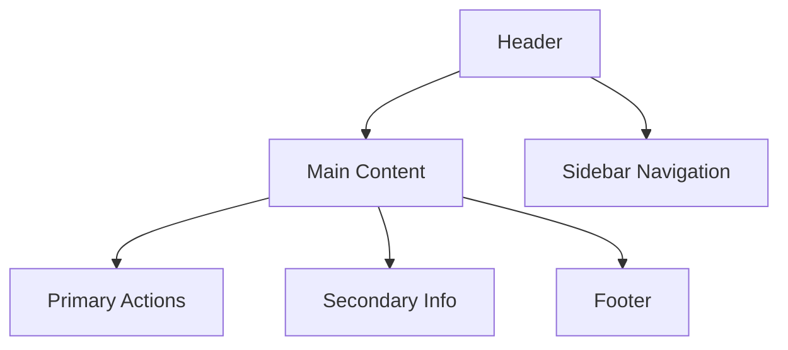

# **Выполнение задания. Дизайн интерфейсов**

## **Цель работы**

На основе ранее созданного прототипа информационной системы выполнить модернизацию интерфейса, улучшив его удобство использования, адаптивность, визуальную структуру и производительность.

Работа выполняется в одном из инструментов:

- Figma;
- Draw.io;
- Whimsical;
- Penpot;
- Adobe XD.

---

## **8.1. Подготовительный этап**

### **Сбор материалов ранее созданного прототипа**

Студент должен подготовить:

- скриншоты текущей версии интерфейса или файл Figma / Draw.io;
- результаты анализа UX (если выполнялся ранее);
- описание логики экранов;
- структуру DOM (при наличии фронтенд-реализации).

**Цель шага:** определить элементы интерфейса, требующие оптимизации.

---

## **8.2. Построение нового прототипа с оптимизацией интерфейса**

### **Создание или обновление основных пользовательских интерфейсов**

Необходимо переработать:

- главный экран;
- навигационную область (меню / хедер / сайдбар);
- ключевые страницы: список, карточка, форма, поиск;
- пользовательские сценарии (User Flow → экран).

### **Требования к интерфейсам**

Каждый экран должен содержать:

- логичную визуальную иерархию;
- чистую структуру без избыточных элементов;
- единый визуальный стиль (цвета, сетка, типографика);
- согласованные элементы управления (ритм, отступы, выравнивание).

### **Пример структуры главного экрана**

```text
[ Логотип ] [ Меню ] [ Профиль ]

----------------------------------------

Крупный заголовок
Краткое описание

[ Основные действия ]
[ Второстепенные функции ]

----------------------------------------
Футер
````

**Пример схемы экрана (Mermaid):**



---

## **8.3. Адаптивные версии: Desktop / Tablet / Mobile**

### **Построение адаптивных макетов**

Для каждого ключевого экрана необходимо подготовить:

* Desktop (≥ 1280 px);
* Tablet (768–1024 px);
* Mobile (≤ 480–600 px).

### **Правила адаптации**

| Элемент  | Desktop        | Tablet                    | Mobile             |
| -------- | -------------- | ------------------------- | ------------------ |
| Сетка    | 12 колонок     | 6–8 колонок               | 1–4 колонки        |
| Меню     | Горизонтальное | Бургер + укороченное меню | Бургер             |
| Карточки | 3–4 в ряд      | 2 в ряд                   | 1 в ряд            |
| Текст    | Обычный размер | Чуть крупнее              | Крупный и короткий |

Макеты должны обеспечивать:

* единую навигационную логику;
* корректные отступы и визуальный ритм;
* читаемость текстов;
* зоны взаимодействия не менее **44×44 px**.

---

## **8.4. Оптимизация элементов интерфейса (упрощение DOM)**

### **Анализ интерфейса на избыточность**

Необходимо выявить:

* дублирующиеся кнопки;
* чрезмерную вложенность блоков;
* тяжёлые UI-паттерны;
* декоративные контейнеры без функциональной нагрузки;
* длинные формы без логической группировки.

### **Пример оптимизации DOM**

**До оптимизации:**

```text
div.container
  div.wrapper
    div.card
      div.card-header
        h2
```

**После оптимизации:**

```text
section.card
  h2
```

### **Типовые решения**

* замена таблиц карточками;
* удаление лишних рамок и разделителей;
* использование иконок вместо текста (при сохранении понятности);
* объединение близких элементов;
* скрытие второстепенной информации под «Подробнее».

---

## **8.5. Дизайнерские анимации и микроанимации**

### **Проработка микровзаимодействий**

Типы микроанимаций:

1. **Hover-эффекты**

   * подсветка;
   * изменение границы;
   * масштабирование иконок.
2. **Feedback**

   * подсказки;
   * состояния «Загрузка…».
3. **Переходы между экранами**

   * Slide;
   * Fade;
   * Scale.
4. **Анимация списков**

   * плавное появление;
   * анимация сортировки.

**Пример описания анимации (кнопка «Сохранить»):**

```text
- Hover: scale 1.03
- Active: scale 0.98
- Disabled: opacity 50%
- Animation: 120–180 ms, ease-in-out
```

---

## **8.6. Оптимизация графики в дизайне**

### **Подготовка графических ресурсов**

Требования:

* **Форматы:** WebP, AVIF (изображения), SVG (иконки);
* **Компрессия:** TinyPNG, Squoosh, ImageOptim;
* **Масштабируемость:** вектор вместо PNG, retina-версии;
* **Responsive Images** (при последующей вёрстке).

**Пример responsive-разметки:**

```html

```

---

## **8.7. Итоговый комплект работы**

Студент должен предоставить:

1. описание исходной версии интерфейса;
2. перечень выявленных UX/UI-проблем;
3. новые экраны (изображения или ссылки);
4. адаптивные макеты (Desktop / Tablet / Mobile);
5. анимации (при наличии);
6. список улучшений с обоснованиями;
7. примеры оптимизации графики;
8. ссылку на GitHub-репозиторий с документацией.

```
