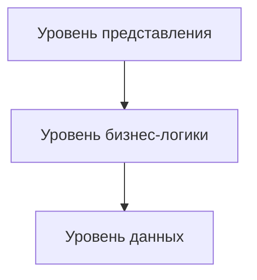
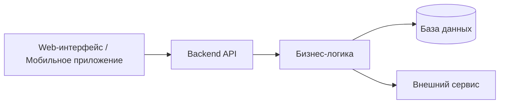
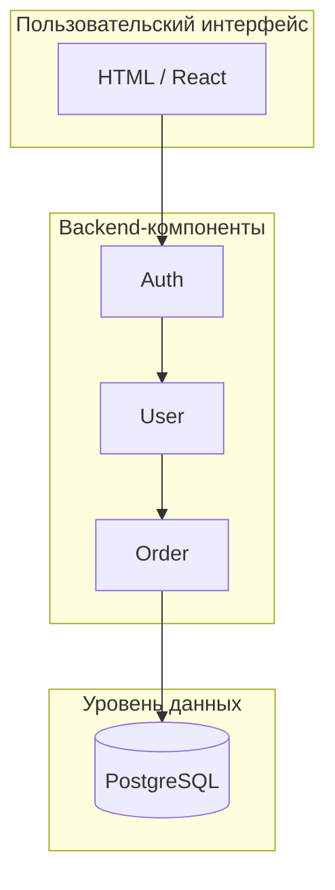
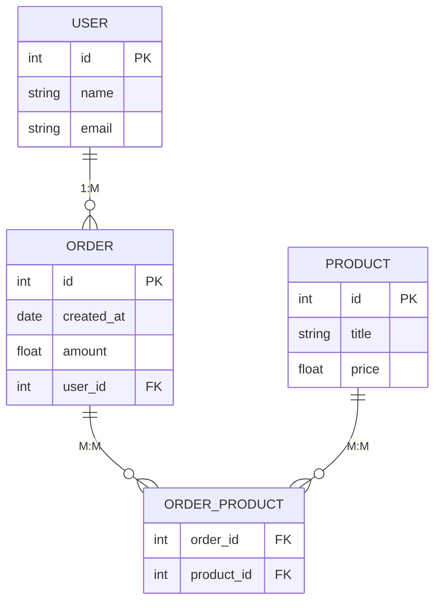
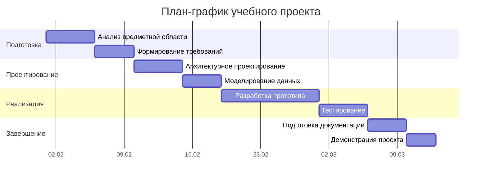

# **Теория. Проектирование и документация в разработке информационных систем**

## **1. Теория**

### **1.0. Цель работы**

Целью лабораторной работы является формирование у обучающихся теоретических знаний в области проектирования информационных систем, освоение основных подходов к анализу предметной области, архитектурному проектированию, моделированию данных и планированию разработки программных решений.

---

### **1.1. Анализ предметной области и формирование требований**

**Предметная область** — это совокупность процессов, объектов, участников и правил реальной деятельности, для которой разрабатывается программное обеспечение. Анализ предметной области направлен на изучение функционирования организации или системы с целью выявления задач, подлежащих автоматизации.

Анализ предметной области является начальным этапом проектирования информационной системы и представляет собой процесс системного исследования деятельности организации. В рамках анализа изучаются:

* бизнес-процессы;
* роли и участники;
* объекты и их взаимосвязи;
* информационные потоки;
* ограничения и правила обработки данных.

Цель анализа предметной области — получить целостное и структурированное представление о том, **какие задачи решаются в организации, кем и каким образом**, а также определить перечень функций, которые целесообразно реализовать в программном продукте.

**Пример:**
Для интернет-магазина предметной областью является процесс онлайн-продаж товаров, включающий оформление заказов, оплату, доставку и взаимодействие с клиентами.

---

### **1.1.1. Методы анализа предметной области**

В процессе анализа предметной области применяются следующие методы:

* интервьюирование заинтересованных сторон (Stakeholder Interview);
* наблюдение за процессами (Observation);
* анализ документации (Document Analysis);
* исследование текущего состояния системы (As-Is);
* графическое моделирование процессов и требований с использованием BPMN, диаграмм вариантов использования (Use Case) и контекстных диаграмм.

Использование указанных методов позволяет выявить функциональные и нефункциональные требования к разрабатываемой системе.

---

### **1.2. Основы архитектуры веб-приложений**

Архитектура веб-приложения определяет структуру программной системы, принципы взаимодействия её компонентов и распределение ответственности между ними. Грамотно спроектированная архитектура обеспечивает масштабируемость, надёжность и удобство сопровождения программного продукта.

---

### **1.2.1. Трёхуровневая архитектура**

Одной из наиболее распространённых архитектурных моделей является трёхуровневая архитектура, включающая:

* уровень представления (пользовательский интерфейс);
* уровень бизнес-логики;
* уровень данных.

Данная архитектура обеспечивает логическое разделение компонентов системы и упрощает её развитие.

---

### **1.3. Архитектурные схемы**

Архитектурные схемы используются для наглядного представления структуры программной системы и взаимодействия её компонентов.

---

### **1.3.1. Блочная схема (Block Diagram)**

Блочная схема отражает основные компоненты системы и направления потоков данных между ними.

---

### **1.3.2. Компонентная диаграмма**

Компонентная диаграмма позволяет детализировать структуру системы и показать взаимосвязи между программными модулями.

---

### **1.4. Моделирование данных (ER-диаграммы)**

ER-диаграммы применяются для моделирования структуры данных информационной системы, определения сущностей, их атрибутов и связей между ними.

---

### **1.5. Планирование разработки и диаграммы Ганта**

Диаграмма Ганта используется для календарного планирования разработки программного обеспечения. Она позволяет визуально отразить этапы проекта, сроки выполнения задач и их последовательность.

---

### **1.5.1. Назначение диаграммы Ганта**

Диаграмма Ганта позволяет:

* планировать этапы жизненного цикла ПО;
* контролировать сроки выполнения работ;
* выявлять зависимости между задачами;
* оценивать загрузку исполнителей;
* определять критический путь проекта.

---

### **1.5.2. Пример диаграммы Ганта**

 